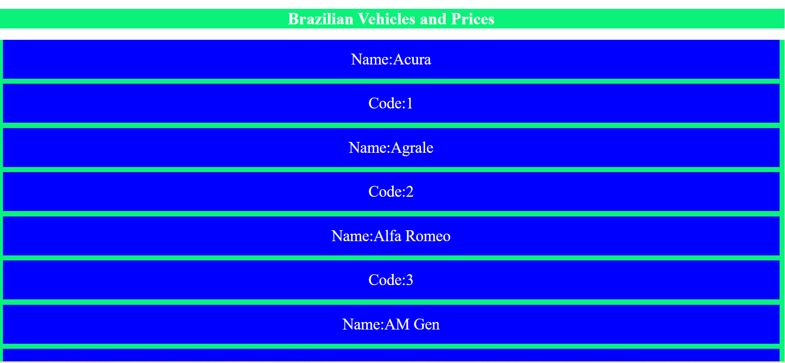

# 🚗 Promise-T-1(Brazilian Vehicles and Prices)

This project fetches data from the **Brazilian FIPE API** to display vehicle brands along with their codes. It demonstrates the use of **JavaScript Promises / async-await**, API integration, and DOM manipulation.

---

## 🚀 Features
- Fetches live vehicle brand data from the FIPE API.  
- Displays vehicle **name** and **code** dynamically on the webpage.  
- Uses **async/await** for clean API handling.  
- Styled with simple and responsive **CSS**.  

---

## 📂 Project Structure
promise-T-1/
├── index.html # Main HTML file
├── style.css # Styles for the app
└── script.js # API fetch + DOM rendering logic


---

## 🔧 Clone and Setup
 Clone the repository:
   ```bash
   git clone https://github.com/Elanthiran/promise-T-1.git
   cd promise-T-1
   ```
---

📌 Usage

1. On loading the page, vehicle brands are fetched from the FIPE API.

2. Each brand is displayed with its Name and Code.
   
---

## 📷 Screenshots



---

## 🛠️ Tech Stack

- HTML5 – Structure

- CSS3 – Styling

- JavaScript (ES6) – Logic, API Fetch

- FIPE API – Vehicle Data

---

## 🔮 Future Improvements

- Add search functionality for vehicle brands.

- Display vehicle models and prices using FIPE endpoints.

- Make a more modern UI with Bootstrap or TailwindCSS.

- Add pagination for large data sets.

  ---

## 🤝 Contributing

Contributions are welcome!

- Fork the repo

- Create a new branch (feature-branch)

- Commit changes

- Open a Pull Request

---

## 📜 License

This project is licensed under the MIT License.
You are free to use, modify, and distribute this project.
